# vscode-extensions 必備插件

* 紀錄與分享 vscode 插件，包含提升*開發效率、不可不擁有的、美化主題(theme)環境*...等
* 本專案會詳細介紹每個插件的使用方式，希望可以幫助到各地碼農們，讓大家一起開心敲代碼吧 :sunglasses:

- 插件大綱
    - [快速下載多個插件](#快速下載多個插件)
    - [主題 Theme](#主題-theme)
    - [美化編輯器、編輯環境](#美化編輯器編輯環境)
    - [不可不擁有的、非常大推](#不可不擁有的、非常大推)

---

## :star:快速下載多個插件 (請先看這邊)
待會將介紹非常多 vscode 插件，這邊提前告知大家一個絕招，能夠快速下載好多個插件，而不必一個個去尋找
(大家可以透過第三步驟，下載本專案附上的`.ps1`檔案，並從中排除自己不要的插件)
未來若要在新電腦移植舊電腦插件，同樣也可以透過該方法~:kissing:

> 方法:
> 1. 存取當前電腦 vscode 的所有插件，輸出成文本，於 `terminal (powershell)` 中輸入以下指令:
> `code --list-extensions | ForEach-Object {"code --install-extension $_"} > extensions.ps1`
> 2. 執行完指令後，會在當前目錄得到 `<extensions.ps1` 檔案 (檔名在執行指令時定義)
> 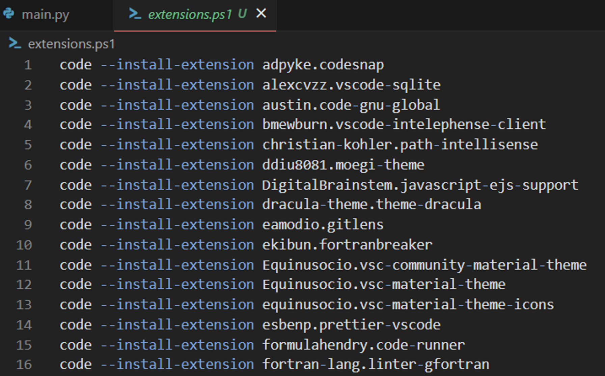
> 3. 在新電腦中，於 `terminal (powershell)` 中輸入以下指令:
> `.\extensions.ps1`
> 4. 下載完成

---

## :purple_heart:主題 Theme

使用 vscode 最大的原因莫過於**炫炮、優雅、耐看、舒服**的編輯畫面，好看的編輯環境才能使碼農心甘情願的敲鍵盤阿~:sunglasses:

接下來，作者會把自己長年使用的主題一一分享給各位 (以下範例皆以 `Python` 為例，不同語言會有些微差異)

阿! 在稍等一下，這邊要教大家一個快速切換主題的方法，畢竟之後各位可能會每天換一個主題也說不定~

> 快速切換主題:
> 1. "ctrl+shift+p": 打開 vscode 命令輸入框
> 2. "Preferences: Color Theme": 輸入、選擇您要的主題

### ButterTheme
* 如同其名，不傷眼的*奶黃色系*
* 非常罕見的主題 (說難聽一點就是沒啥人用阿)，作者獨愛這個
* 怕各位找不到這個，附上<a href="https://marketplace.visualstudio.com/items?itemName=Levampire.Buttur" target="_blank">連結</a>

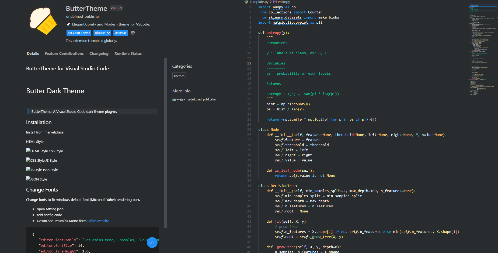

### Coder200
* 這次看名字，完全毫無想法了...
* 非常罕見的主題，充滿著*橘橙色*，so sexy~:flushed:

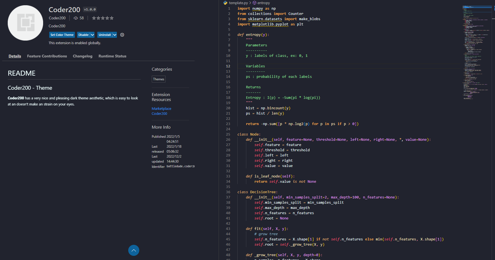

### Dracula Official
* 非常知名，充滿著*粉色*與*紫色*的吸血鬼色

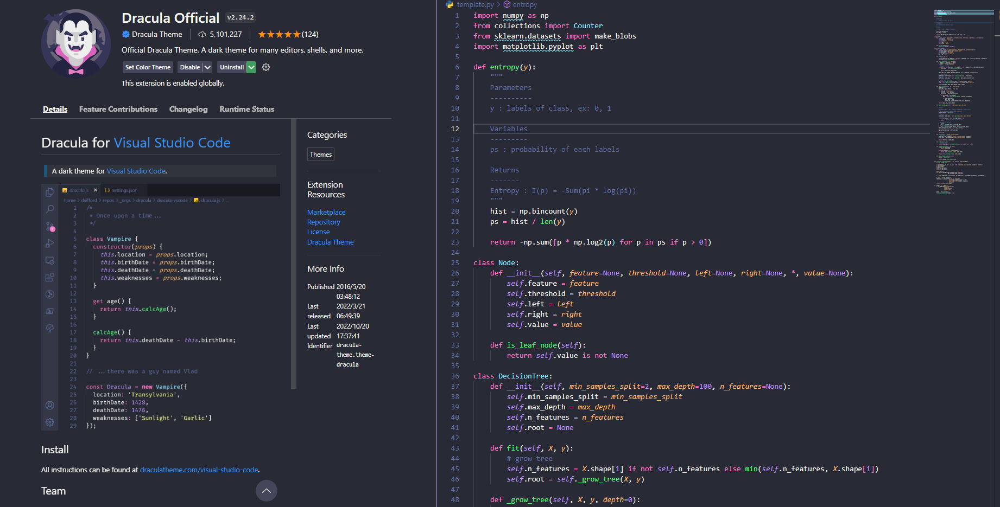

### LaserWave
* 帶有夕陽感覺的*紫粉色*

### Moegi Theme
* 溫和、不傷眼的主題

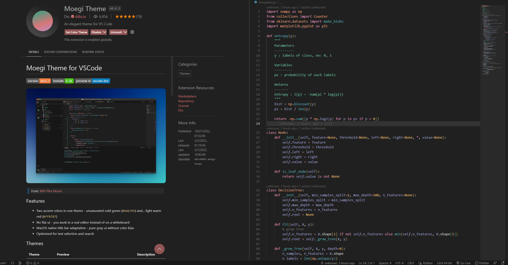

### Panda Theme
* 具有*湖水綠* 的頂級主題:panda_face:
* 該主題真的很香

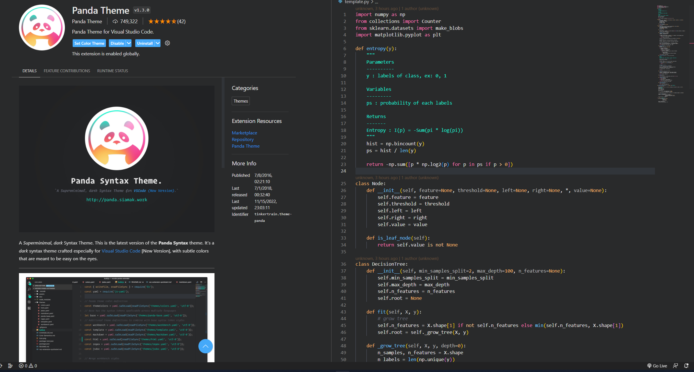

### Simple Dark
* 背景非常黑，文字顏色也不會太刺眼

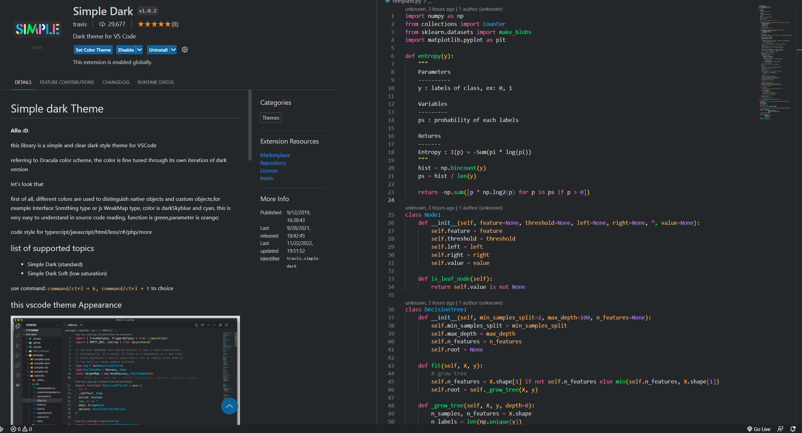

### Skyline
* 喜歡藍色的朋友一定要用:blue_heart:

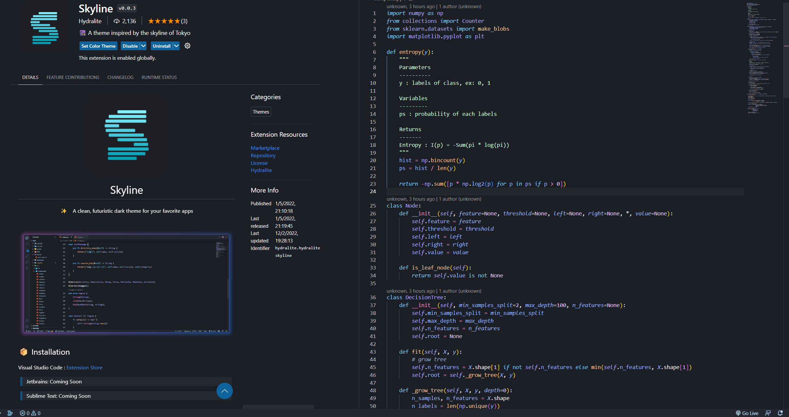

### SynthWave '84
* 超級高科技、炫炮的螢光主題:sunglasses:
* 選完主題後，記得啟動螢光效果 (該效果也可以搭配其他主題色哦:fu:)

> 啟動螢光模式:
> 1. "ctrl+shift+p": 打開 vscode 命令輸入框
> 2. "Synthwave '84: Enable/Disable Neon Dreams": 開啟、關閉 (附圖)
> 3. "Restart": 重啟 vscode

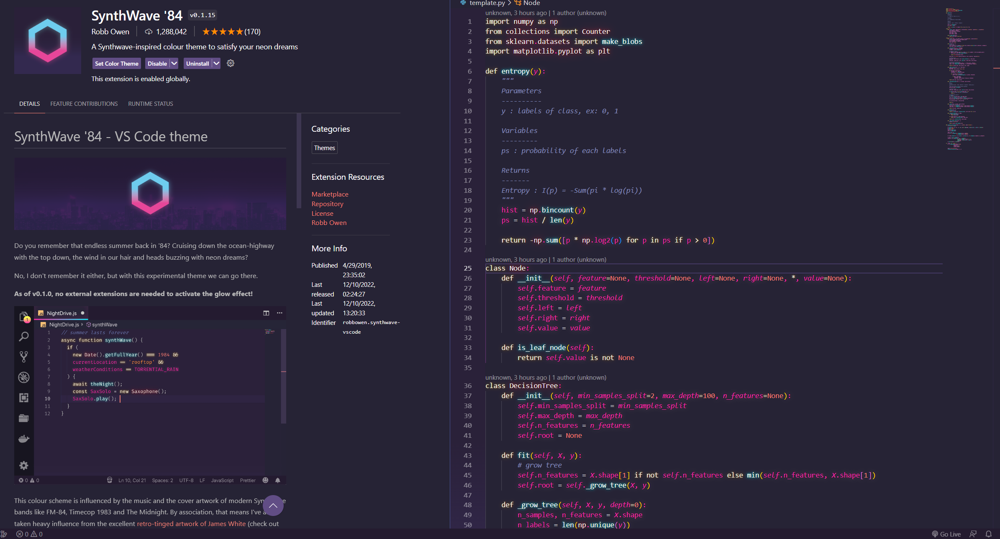

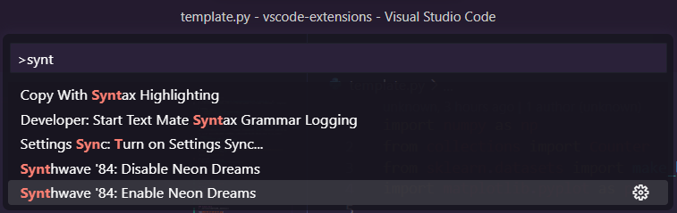

### Tearz
* 與前面介紹的 Moegi 有點相似
* 但是這個*紫色*真的太吸引作者了~

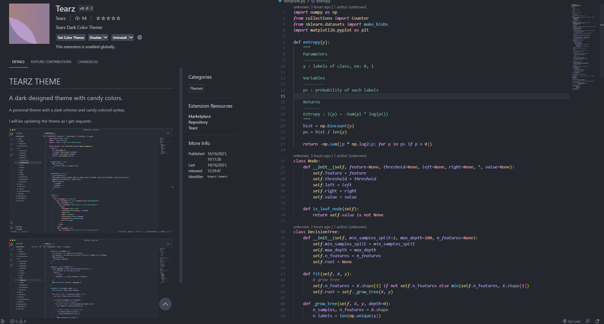

### Xcode Theme
* 經典主題之一，不敢忽略

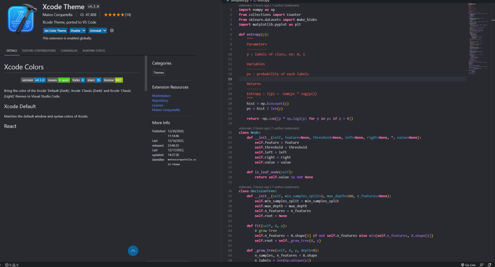

### One Dark Pro
* 經典主題之一，不敢忽略

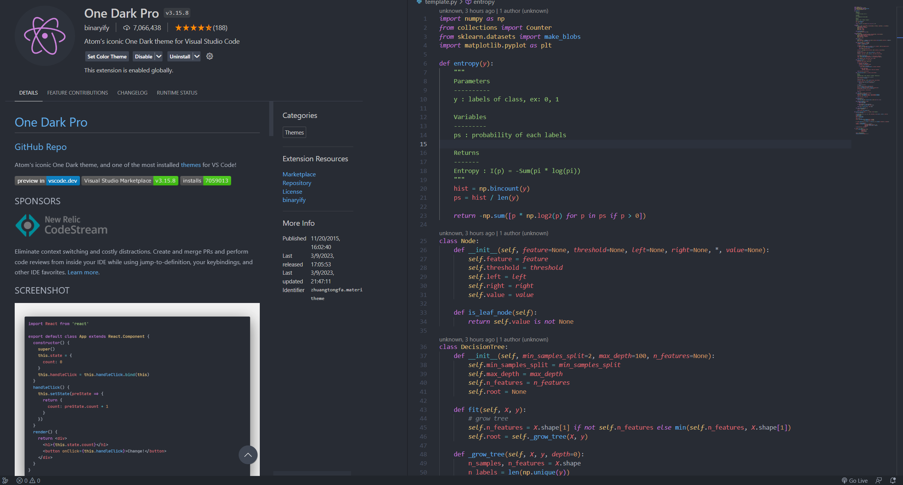

### Material Dark
* 經典主題之一，不敢忽略

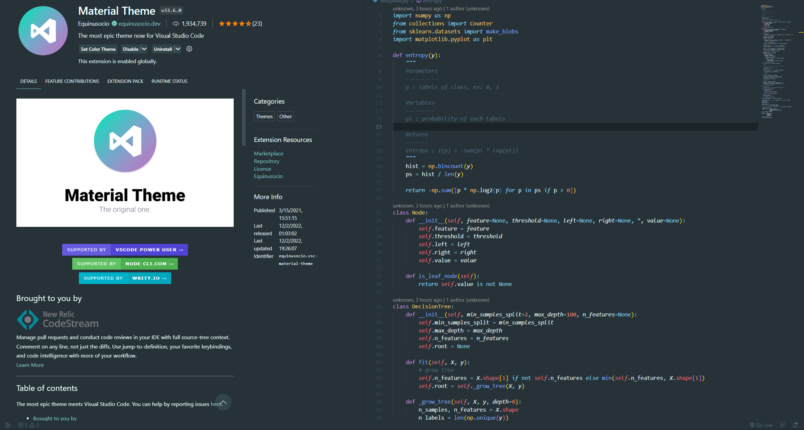

<a href="#top">Back to top</a>

---
## :yellow_heart:美化編輯器、編輯環境
裝潢好我們的編輯器之後，接下來要介紹的插件不僅可以增加美觀，還可以提升工作效率哦~

### Color Highlight
* 如果您是**前端工程師**或**數據分析師**，常常需要進行**視覺化**工作，您一定要下載這個 !
* 在編輯時，只要出現*十六進制*的顏色表達式，就可以清楚看到顏色囉 (再也不用執行完代碼，才知道顏色好不好看)

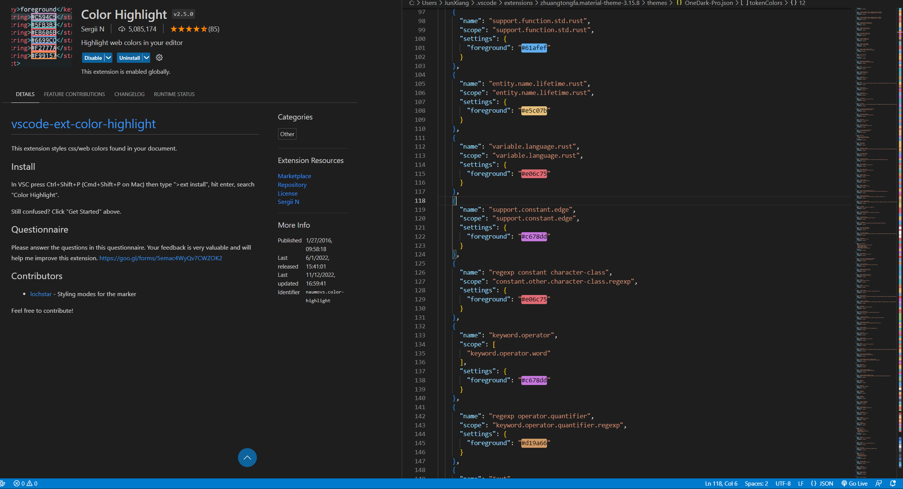

### Material Theme Icons
* 不同附檔名，不同的 Icon
* 除了好看之外，還可以讓自己在找檔案時更快速

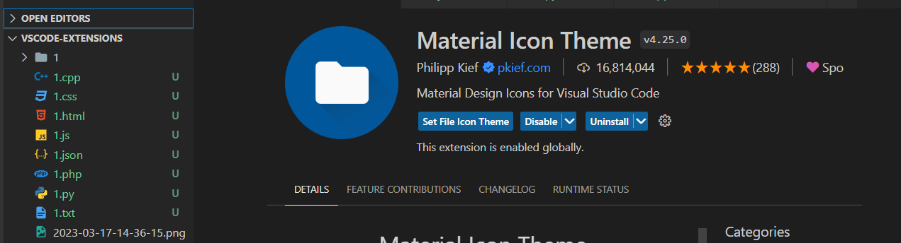

### vscode-icons
* 與 Material Theme Icons 略為不同
* 作者偏好使用這個~

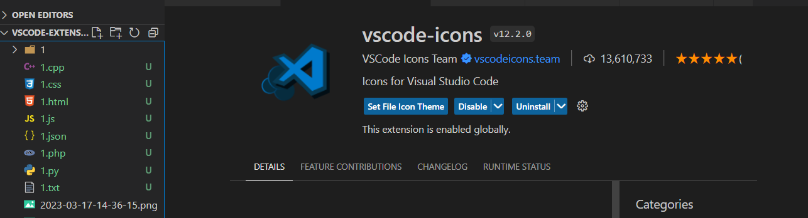

<a href="#top">Back to top</a>

---
## :green_heart:不可不擁有的、非常大推
以下要介紹的插件，真的非常好用!
絕大部分都是可以提升開發效率的，走過路過千萬不要錯過:heart_eyes:

### Code Runner
* 相信使用 vscode 的大家，應該不會不熟悉這插件吧!?
* 可以讓 vscode 一鍵執行程式
* 支援大量語言，例如: C, C++, Java, JavaScript, PHP, Python, Perl...等 

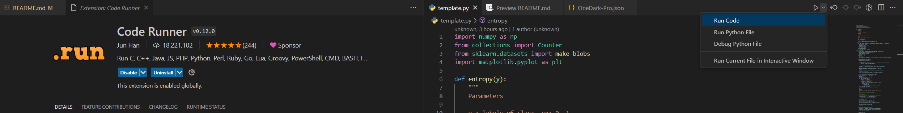

### Comment Divider
* 快捷鍵生成好看*註釋風格*
* 如下圖，可以看到 `Shift+Alt+x` 及 `Alt+x` 兩種風格 

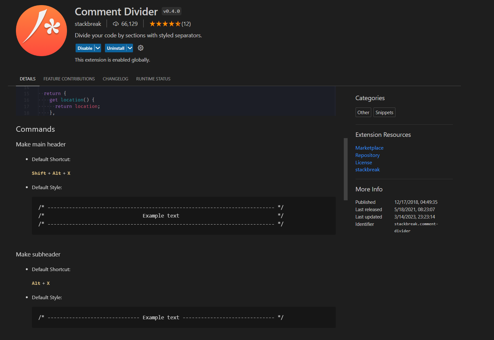

### autoDocstring - Python Docstring Generator
* 該插件是針對 `Python` 開發者所介紹
* 快解鍵生成 *Docstring* 風格的註釋
* 描述函式目的、參數、回傳值...等訊息
* 支援不同種 *Docstring*，例如 `google`, `sphinx`, `numpy`...等

> 使用方式，在要生成註釋的地方按:
Windows: `ctrl+shift+2`
Mac: `cmd+shift+2` 

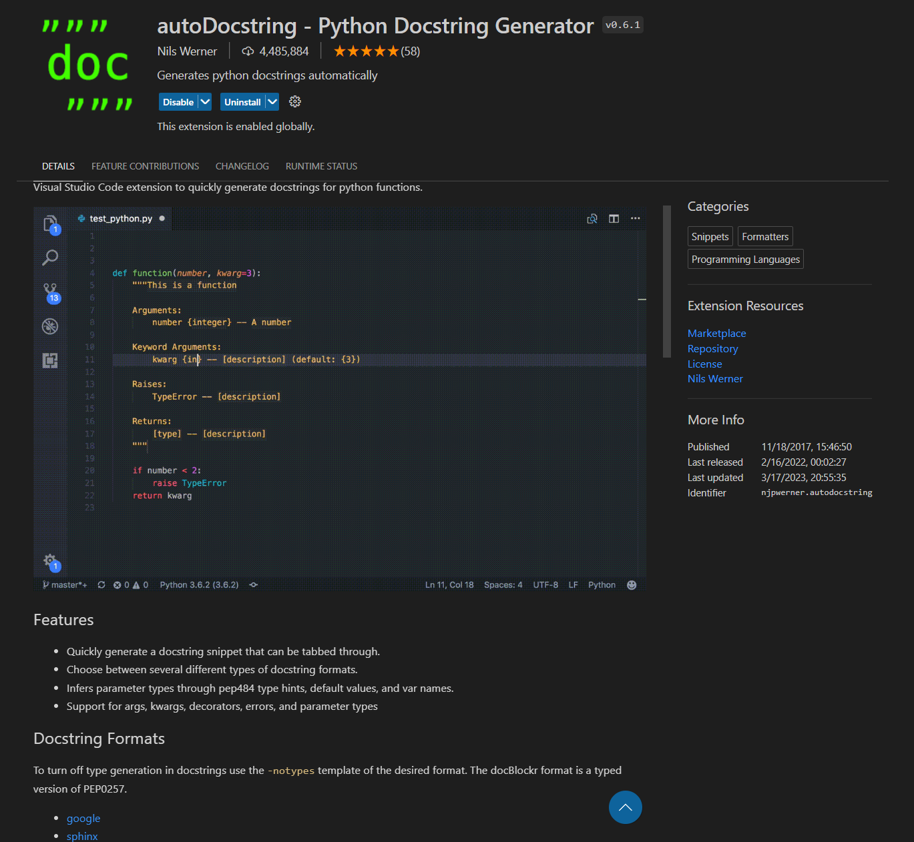

### Draw.io Integration
* 流程圖繪製工具
* 進行專案設計時，可以利用該插件規劃好可行性
* 可以做為筆記使用
* 支援許多常用圖案，例如 Google Cloud Platform 代表功能符 (如圖)

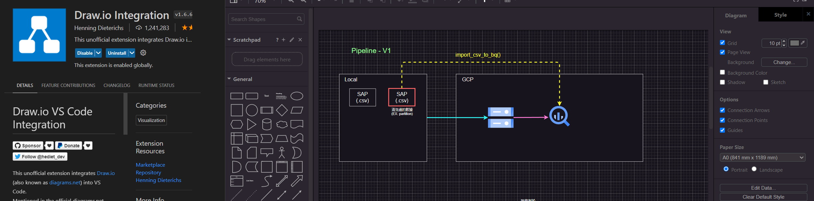

### Path Intellisense
* 編碼時擁有這個插件，真是幸福:kissing_heart:
* 適合常常讀寫檔案的碼農使用
* 寫路徑時，會自動列出您尋找路徑下的檔案

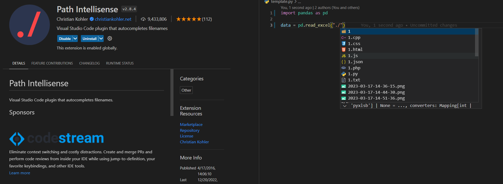

<a href="#top">Back to top</a>

---

## 透明化編輯器
透明化特效就是牛
可以成為工作偷懶神器 (邊看影片邊敲代碼~)
可以搭配自己的桌布，邊看自己老婆邊敲代碼

### GlassIt-VSC

> 使用方式:
`ctrl+alt+z`: 調低飽和度 (透明)
`ctrl+alt+c`: 調高飽和度 (不透明)

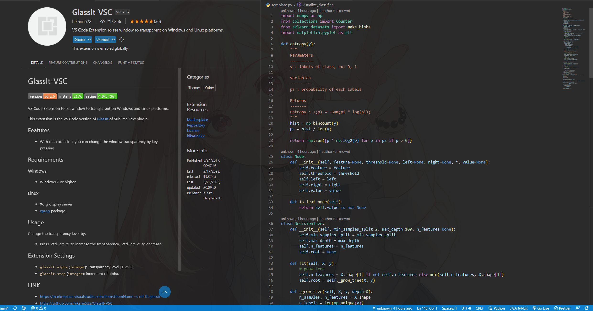

<a href="#top">Back to top</a>

---

## 大數據、AI 工程師 - Jupyter (Python)
這邊要介紹的插件真的很屌!
作者認識很多玩 `Python` 的人不習慣使用 vscode，很多原因都是:
* Vscode 不像 Spyder, Pycharm 一樣，可以方便的察看數據表 (尤其很愛用 `DataFrame` 的人)
* 不習慣使用 Vscode 的 Debug 模式
* 希望以交互模式執行代碼

該插件提共了以下功能:
* **交互模式**
* 查看變數資料型態、變數值 (就如同 spyder, pycharm 一樣)
* **逐行執行程式**、**部分執行程式碼** (這個功能真的很實用，比Debug還好用~:heart_eyes:)

> 如果您聽得懂中文，建議可以花 5 分鐘快速了解 Jupyter 插件的用法 (觀看<a href="https://www.bilibili.com/video/BV1Bg411J78F/" target="_blank">連結</a>)

> 使用方法:
> * 下載以下插件 (有些應該不用，但小弟忘記啦~)
`Jupyter`, `Jupyter keymap`, `Jupyter slide show`, `Jupyter cell tag`, `Jupyter notebook renderes`, `vs code jupyter notebook previewer`
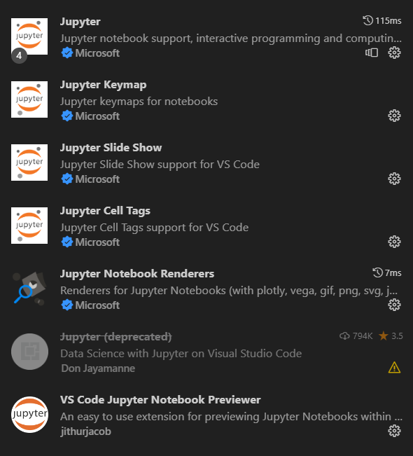

> * **以交互模式執行代碼**
> 1. 於腳本中滑鼠右鍵
> 2. 選擇 `Run Current File in Interactive Window` (建議設置vscode快捷鍵，本人設置 `F10`)
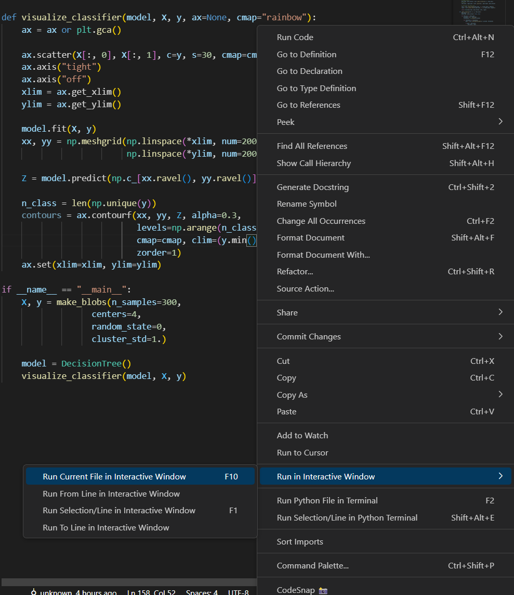
> 3. 執行完時，會出現 `Interactive` 視窗:
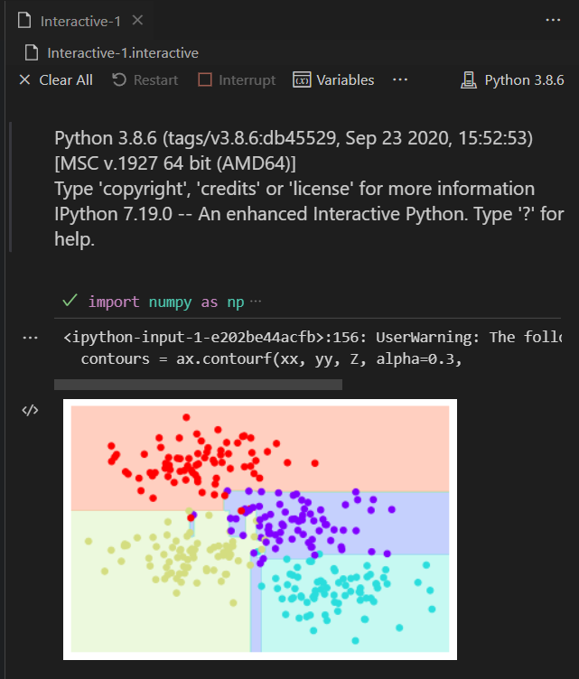

> * **查看變數資料型態、變數值** (需處在交互模式中)
> 點選交互視窗中的 `Variables`
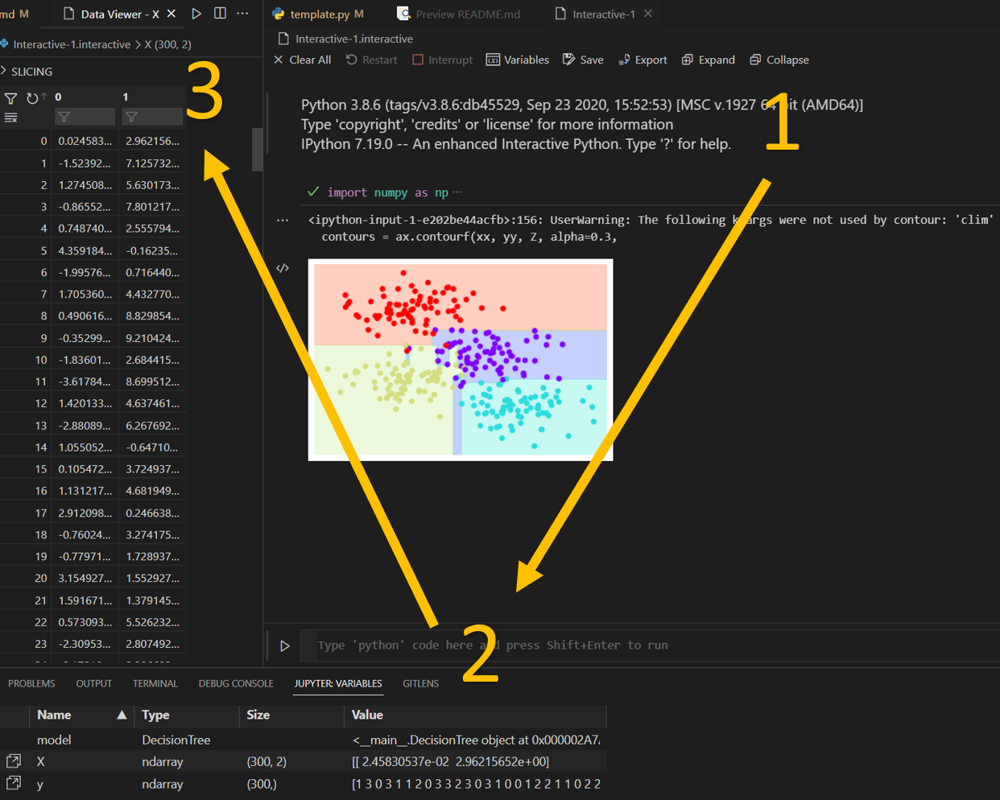

> * **逐行執行、部分執行**
> 1. 選取要執行的程式碼 (可以是一行或多行)
> 2. 滑鼠右鍵
> 3. 選擇 `Run Selection/Line in Interactive Window`
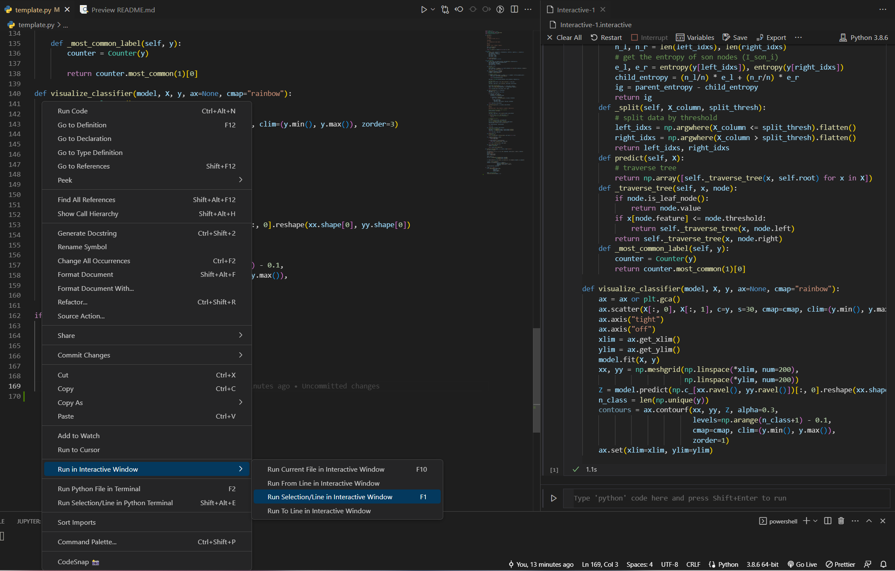

---

## Git、Markdown 輔助
接下來介紹的插件，如果您也是個 Github, Gitlab 專案開發者，您一定要看~

### GitLens
* 可以看到下載完後，腳本中的代碼會顯示哪些是**改過的**、標註出**誰改的**、標註**何時改的**
* 注意看右半區塊的代碼，`170` 行有*綠色*的線，表示此地有*新增代碼*紀錄 (*紅色*則是有*刪減*)
* 記得專案要用 `git` 追蹤，該插件才有用哦

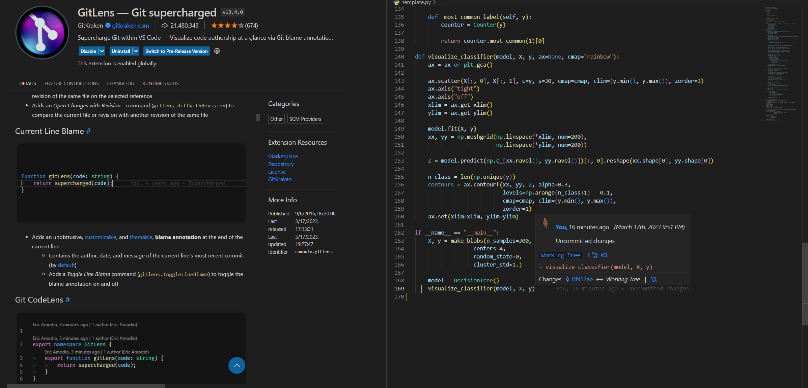

### Markdown Preview Enhanced
* 編寫 `.md` 檔案時，可以預瀏覽結果
* `ctrl+k` 接著 `v`，打開預覽畫面
* 下圖中間是 `.md` 檔案，右邊則是預覽畫面

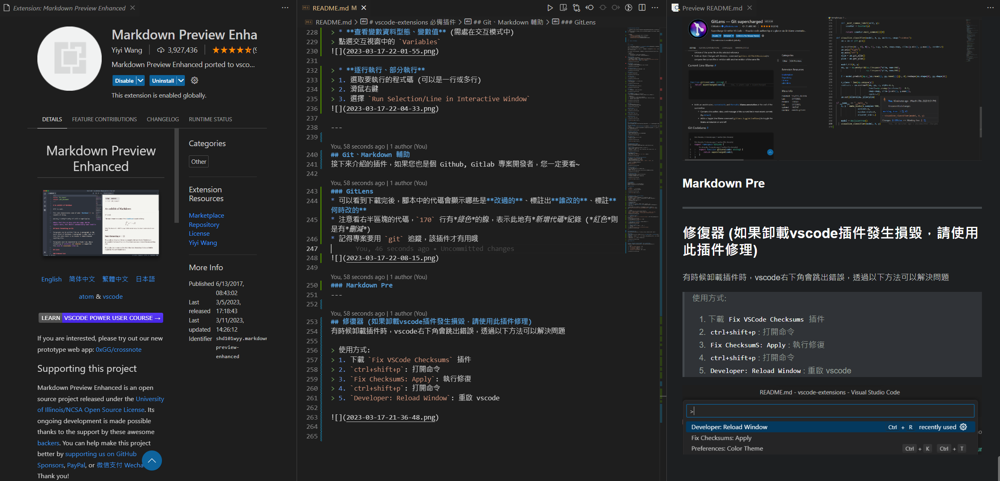

---

## 修復器 (如果卸載vscode插件發生損毀，請使用此插件修理)
有時候卸載插件時，vscode右下角會跳出錯誤，透過以下方法可以解決問題

> 使用方式:
> 1. 下載 `Fix VSCode Checksums` 插件
> 2. `ctrl+shift+p`: 打開命令
> 3. `Fix ChecksumS: Apply`: 執行修復
> 4. `ctrl+shift+p`: 打開命令
> 5. `Developer: Reload Window`: 重啟 vscode

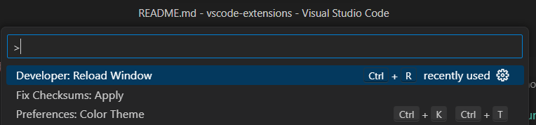

 