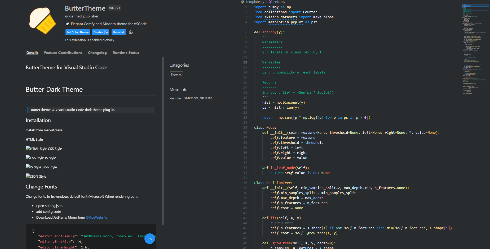
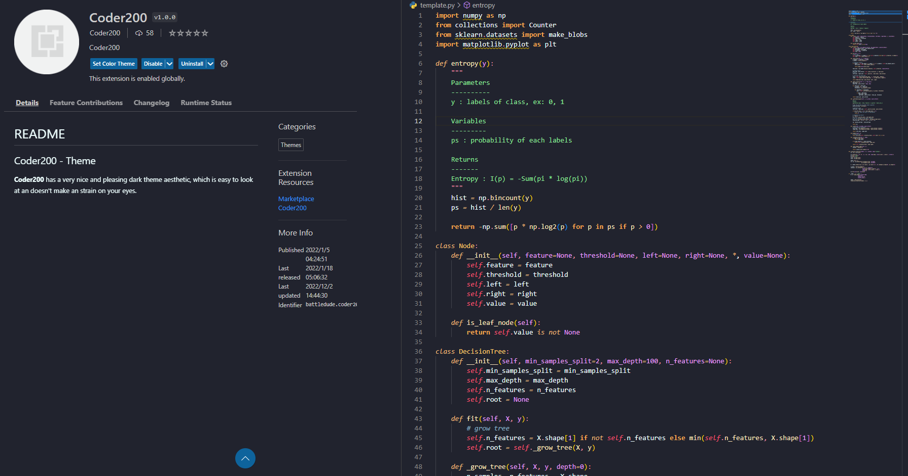
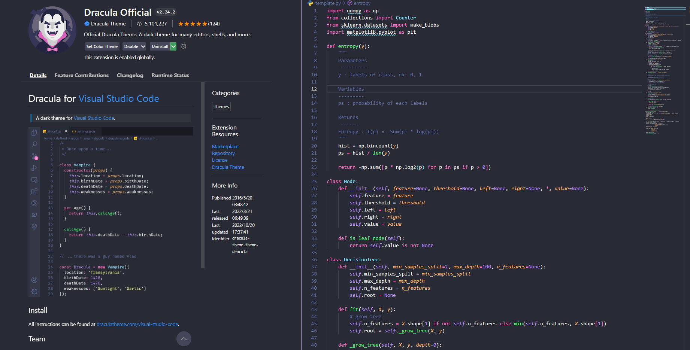

# vscode-extensions 必備插件

* 紀錄與分享 vscode 插件，包含提升*開發效率、不可不擁有的、美化主題(theme)環境*...等
* 本專案會詳細介紹每個插件的使用方式，希望可以幫助到各地碼農們

- 插件大綱
    - [主題 Theme](#主題-theme)
    - [美化編輯器、編輯環境](#美化編輯器編輯環境)
    - [不可不擁有的](#不可不擁有的)

---

## 主題 Theme

使用 vscode 最大的原因莫過於**炫炮、優雅、耐看、舒服**的編輯畫面，好看的編輯環境才能使碼農心甘情願的敲鍵盤阿~:sunglasses:

接下來，作者會把自己長年使用的主題一一分享給各位 (以下範例皆以 `Python` 為例，不同語言會有些微差異)

阿! 在稍等一下，這邊要教大家一個快速切換主題的方法，畢竟之後各位可能會每天換一個主題也說不定~

> 快速切換主題:
> 1. "ctrl+shift+p": 打開 vscode 命令輸入框
> 2. "Preferences: Color Theme": 輸入、選擇您要的主題

### ButterTheme

* 如同其名，不傷眼的*奶黃色系*
* 非常罕見的主題 (說難聽一點就是沒啥人用阿)，作者獨愛這個
* 怕各位找不到這個，附上<a href="https://marketplace.visualstudio.com/items?itemName=Levampire.Buttur" target="_blank">連結</a>

### Coder200

* 這次看名字，完全毫無想法了...
* 非常罕見的主題，充滿著*橘橙色*，so sexy~:flushed:

### Dracula Official

* 非常知名，充滿著*粉色*與*紫色*的吸血鬼色

### LaserWave

### Moegi Theme

### Panda Theme

### Simple Dark

### Skyline

### SynthWave '84

### Tearz

### Xcode Theme

### One Dark Pro

### Material Dark

###

---
## 美化編輯器、編輯環境

---
## 不可不擁有的