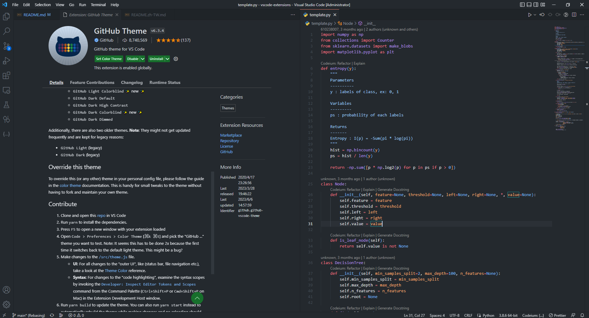
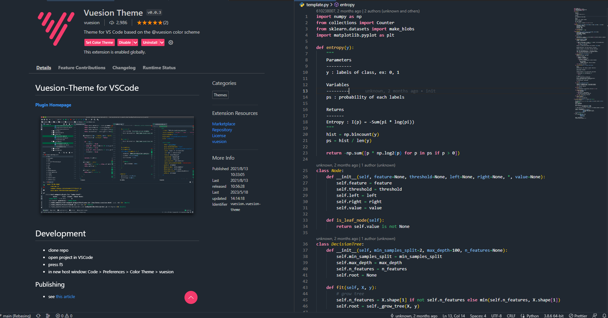
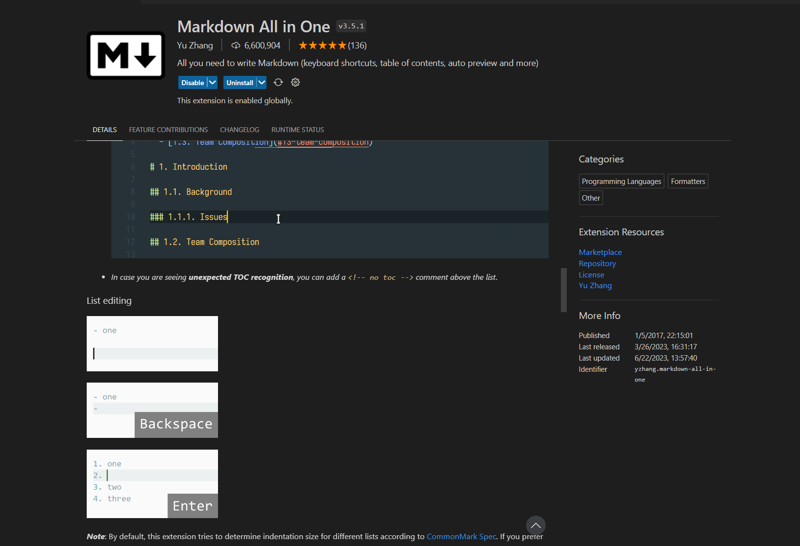
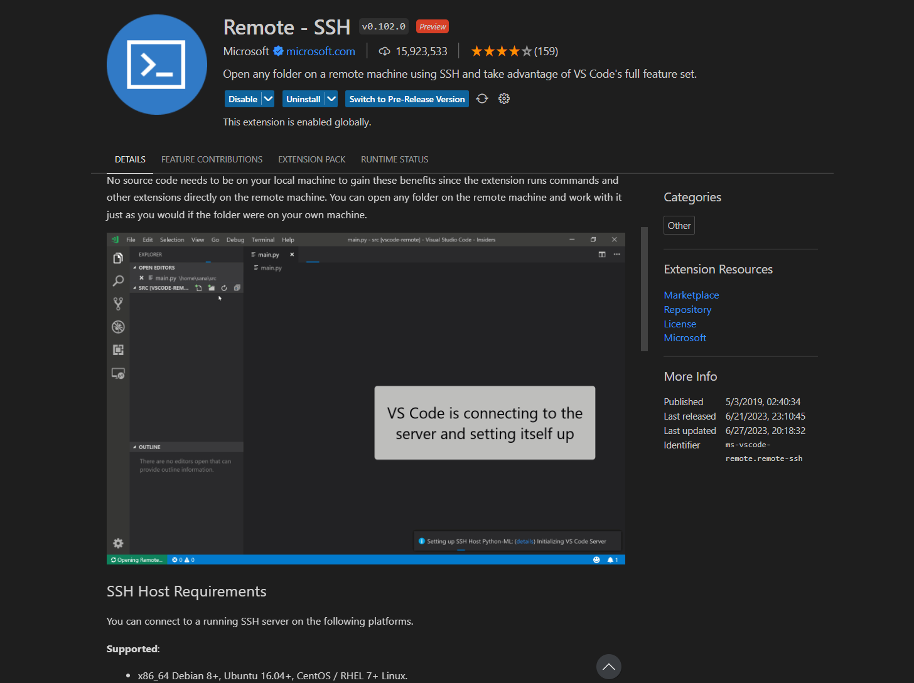
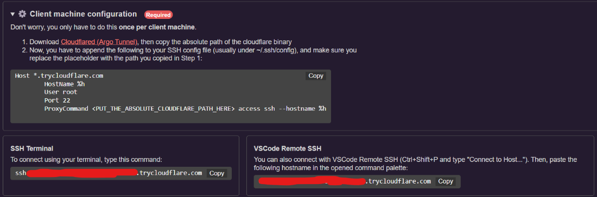
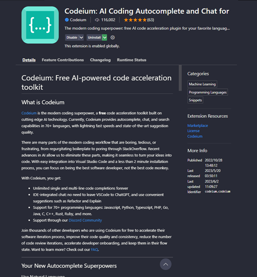
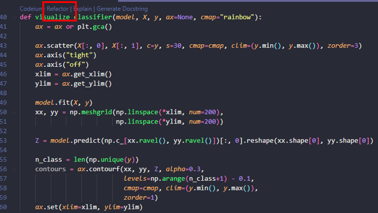
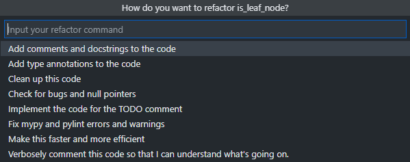
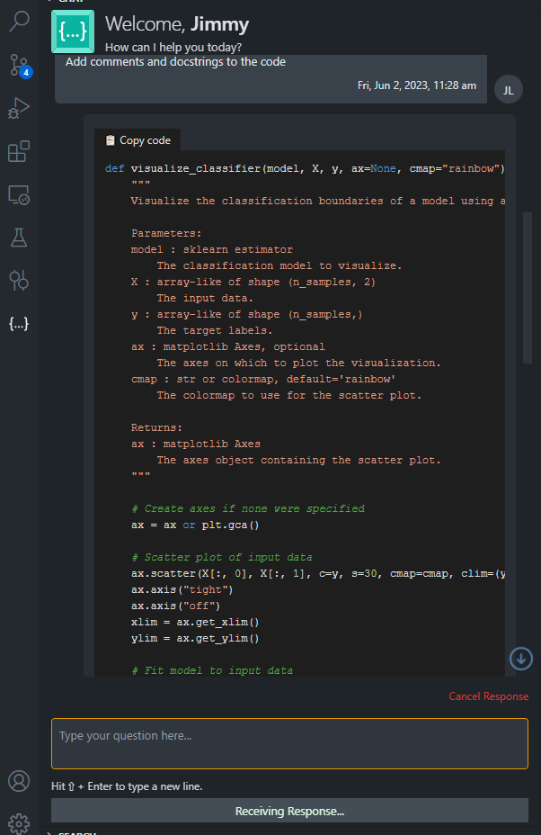

# vscode-extensions [Best]

<div>
    
</div>

[En README](README.md) | [中文版說明檔](README.zh-TW.md)

---

* Record and share vscode extensions, including improving development efficiency, key points, theme beautification, etc. . .
* This project will provide detailed instructions for each extension, hoping to help coders all over the world code happily together: emoji_sunglasses:
* This project provides ["**extended sharing area**"](./share/README.md), you can submit interested extensions here.
* If you want **Pull Request**, just update `README.md`

    ([`README.zh-TW.md`](https://github.com/Lin-jun-xiang/action-translate-markdown/tree/main) will be automatically updated through CI)

* Extended Summary:
     - [Quickly download multiple extensions (read this first)](#starquickly-download-multiple-extensions)
     - [transparent editor](#snowflaketransparent-editor)
    - [theme](#purple_hearttheme)
     - [editor and beautifying environment](#yellow_heart-beautifying-editor-and-editing-environment)
     - [must have and highly recommended](#green_heart-must-have-highly-recommended)
    - [Big Data and AI Engineer-Jupyter(Python)](#star2big-data-ai-engineer---jupyter-python)
     - [Git and Markdown helper](#wavegitmarkdown-support)
     - [Remote WSL and Dev Container](#computer-remote-wsl--dev-container)
     - [Remote-SSH: How to connect VSCode to Colab?](#computer-remote-ssl)
     - [Fixer](#wrenchfixer-fix-vscode-corrupt)
     - [Copilot Assist](#codeium)
     - [Community Shares and Contributions](./share/README.md)

<details>
<summary>Vscode Common Commands</summary>

* Using the vscode command panel can increase the development speed .

* Open command panel: `ctrl+shift+p`

* Common commands:
    * `File: Open Folder`: open folder as workspace .
    * `Preferences: Color Theme`: select color theme for editor .
    * `Preferences: File Icon Theme`: select icon theme for file .
    * `Developer: Reload Window`: Reload VSCode window .

</details>

---

## :star:Quickly download multiple extensions
I will introduce a lot of vscode extensions later . There is a trick here, you can quickly download many extensions without looking for . one by one

If you want to transfer the extension of the old computer to the new computer in the future, you can also use this method: emoji_kissing:

* You can download the `.ps1` file that comes with this project, follow the third step below to exclude the unnecessary extension .
* In the `extensions.ps1` file, each extension has a comment ., please delete the unnecessary . before executing the installation command

> method:
>
> 1. Access all the extensions of vscode on the current computer, the output is text . Enter the following command in the terminal (`powershell`):
> `code --list-extensions | ForEach-Object {"code --install-extension $_"} > extensions.ps1`
>
> 2. After the command is executed, the `extensions.ps1` file will be obtained in the current directory (the file name is defined when the command is executed) .
>
> 3. Enter the following command in the terminal (`powershell`) of the new computer:
> `./extensions.ps1`
>
> 4. download complete
> 

<details>
<summary>Find Missing Extensions</summary>

* [`extensions-compare`](./extensions_compare/)

* Compare two `.ps` files to find **differences** between two extension records .

* Usage (choose one of the following):
    * `compare.py`
         run `Python` script .

        
    * `compare.sh`
         runs `./extensions_compare/compare.sh` etc . on `git bash, wsl, or linux`

        
</details>

---

## :snowflake:Transparent editor
The transparency effect is amazing.

It can be used as a lazy tool (code while watching the video~) .

You can use your own desktop background while coding and watching **Gura** .

### GlassIt-VSC

> Usage:
`ctrl+alt+z`: desaturation (transparency)
`ctrl+alt+c`: increase saturation (opacity)


<a href="#top">Back to top</a>

---

## :purple_heart:Theme

The biggest reason to use vscode is to have `eye-catching`, `elegant`, `comfortable`, `pleasant editing interface`. Only a good-looking editing environment can make the coder willing to type on the keyboard~:sunglasses:

Next, I will share my favorite topics with you one by one (the following examples are based on Python, and different languages may have slight differences)

oh! Wait a minute, here is a quick way to switch themes . After all, you may want to change themes every day~~

> Quick switch theme
>
> "ctrl+shift+p": Open vscode command input box
>
> "Preferences:Color Theme": Enter and choose the theme you want

### Arc Dark for Visual Studio Code
* The theme is a bit similar to the dark theme of Visual Studio Code, but the overall tone is softer, similar to the color of macarons.


### ButterTheme
* As the name suggests, this is an eye-catching *milk yellow* theme
* A very rare theme (to put it bluntly, not many people use it), but the author likes it very much
* If you can't find this theme, <a href="https://marketplace.visualstudio.com/items?itemName=Levampire.Buttur" target="_blank">link</a>


### Coder200
* This time I don't know ... just by looking at the name
* Rare theme, full of *orange*, so sexy~:flushed:


### doom-emacs-theme
* Simple style

<image src="https://user-images.githubusercontent.com/63782903/232356902-fc57dbc3-f650-4c41-b5a6-f33497954cc7.png" width="60%" />

### Dracula Official
*very famous, *pink* and *purple* vampire colors


### Github Theme
* One of the classic themes that cannot be ignored



### LaserWave
* A *purple pink* theme with a sunset feel


### Moegi Theme
* Gentle and charming theme


### Material Dark
* One of the classic themes that cannot be ignored


### One Dark Pro
* One of the classic themes that cannot be ignored


### Panda Theme
* *Lake Green* :panda_face: Top notch themes:
* This theme is really cool!


### Simple Dark
* The background is very dark, the text color will not be too dazzling


### Skyline
* Blue lovers must use it :blue_heart:


### SynthWave '84
* Super high-tech, dazzling fluorescent theme: emoji_sunglasses:
* Remember to turn on the fluorescent effect after selecting the theme (you can also match it with other theme colors: emoji_emoji_fu :)

> Enable fluorescence mode:
>
> 1. "ctrl+shift+p": Open the VS Code command input box
>
> 2. "Synthwave '84: Enable/Disable Neon Dreams": Enable/Disable Neon Dreams (see picture)
>
> 3. "Restart": Restart VS Code


### Tearz
* A bit similar to the previously launched Moe Wood theme
*But this *purple* really attracts the author~


### Vuesion Theme
* Simple pink, looks very comfortable



### Xcode Theme
* One of the classic themes that cannot be ignored


<a href="#top">Back to top</a>

---
## :yellow_heart: Beautifying editor and editing environment
After finishing the decoration, our editor will introduce the plug-ins that can not only increase the aesthetic feeling, but also improve work efficiency~

### Color Highlight
* If you are a **front-end** engineer or **data analyst**, and often need to do **visual** work, be sure to download this!
* When editing, as long as there is **hexadecimal** color expression, you can see the color very clearly (you don’t need to run the code if the color looks good) .


### Material Theme Icons
* Different file extensions have different icons
* Not only looks good but can find files faster.


### vscode-icons
* Slightly different from Material theme icons
* The author prefers to use this~


<a href="#top">Back to top</a>

---
## :green_heart: Must-have, highly recommended
The plugins to be introduced below are really easy to use!

Most of them can improve development efficiency, don't miss: emoji_heart_eyes:

### Code Runner
* I believe that friends who have used VSCode should be familiar with this plugin! ?
* Allow VSCode to execute the program with one click .
* Support multiple languages, such as C, C++, Java, JavaScript, PHP, Python, Perl...etc.


### Comment Divider
* Use shortcut keys to generate beautiful **comment styles** .
* As shown in the figure below, you can see two styles: `Shift+Alt+x` and `Alt+x`.


### autoDocstring - Python Docstring Generator
* This plugin was introduced by . for Python developers
* Use shortcut keys to quickly generate **Docstring** style comments .
* Describe the purpose, parameters, return value and other information of the function.
* Support different **Docstring** styles, such as google, sphinx, numpy, etc. . .

> How to use: Press the key below where you want to generate comments
Windows: `ctrl+shift+2`
Mac: `cmd+shift+2`


### Draw.io Integration
* Flow chart drawing tool
* When designing a project, you can use this plugin to plan the feasibility .
* Can be used as a note taking tool .
* Support many common modes, such as Google cloud platform representative function symbol (as shown in the figure).


### Path Intellisense
* It's really cool to have this plugin when coding :kissing_heart:
* Coder suitable for frequently reading and writing files .
* When writing the path, it will automatically list the files under the path you want to find .


<a href="#top">Back to top</a>

---

## :star2:Big data, AI engineer - Jupyter (Python)
The plugins presented here are really powerful!

The author knows that many people who use Python are not used to using vscode for many reasons:
* Interactive mode
* View variable data type and variable value (just like in Spyder, Pycharm)
* Execute the code line by line, and execute part of the code (really very practical, better than Debug~:heart_eyes:)

The plugin provides the following features:
* :pushpin:**interactive mode**
* :pushpin:** View variable data type and variable value** (such as Spyder, Pycharm)
* :pushpin: **Execute code line by line** and **Execute part of code** (really useful, better than debugging~:heart_eyes :)

> If you can understand Chinese, it is recommended to spend 5 minutes to quickly learn how to use the Jupyter plug-in (see <a href="https://www.bilibili.com/video/BV1Bg411J78F/" target="_blank" >link</a>)

> Usage:
>
> :bulb: Download the following plug-ins (some may not be used, forget it~)
>
> `Jupyter`, `Jupyter keymap`, `Jupyter slide show`, `Jupyter cell tag`, `Jupyter notebook renderes`, `vs code jupyter notebook previewer`
>
>

> :bulb:**Execute code in interactive mode**
>
> 1. right click . in script
> 2. select `Run Current File in Interactive Window`
(It is recommended to set a VS Code shortcut key, I set it to `F10`).
> 3 . `Interactive` window will appear after execution of .
>
>
>

> :bulb:**View variable data type and variable value** (need to be in interactive mode)
>
> Click *Variables*. in the interactive window
>
>

> :bulb: **Execute line by line or partly**
>
> 1. Select the code to execute (can be one or more lines) .
> 2. right click on selected code .
> 3 . SELECT * run select/row in interactive window * .
>
>

<a href="#top">Back to top</a>

---

## :wave:Git、Markdown Support
The plugins described below are essential for developers working on Github or Gitlab projects .

### GitLens
* After downloading, the script code will show **which** parts were **modified**, **who** made the changes, **when** the . was modified
* Note that the .`170` line on the right side of the screen has a green line indicating that there is a new code record (red means deleting the code) .
* Remember to track the project with `git` for this plugin to work .


<details>
<summary>More for GitLens</summary>

* Compare two commits with detailed **differences**
    * `COMMITS`: Select the commit to compare with HEAD (step1~2)
    * `SEARCH & COMPARE`: select changed files (step 3)
    * `diff`: correct file is HEAD (step 4)

        

</details>

### Markdown All in One
* Using Markdown syntax in the vscode editor.
* It provides automatic generation of table of contents.
* It offers special shortcuts for Markdown, such as using `Ctrl+B` for bold formatting.



### Markdown Preview Enhanced
* When writing `.md` file, you can preview the result .
* Press `ctrl+k`, then `v` to open preview window .
* The middle of the figure below is the `.md` file, and the right is the preview window .


### Paste Image
* Paste images directly from the clipboard into markdown/asciidoc (or other files)!
* Usage
    * screenshot to clipboard
    * Use default keybindings: `Ctrl+Alt+V` (`Cmd+Alt+V` on Mac).
    * images will be saved in the folder containing the currently edited file
    * Relative paths will be pasted to the current edited file

* You can configure `imagePath` in settings.

    

<a href="#top">Back to top</a>


---

## :computer: Remote WSL & Dev Container

### Remote WSL
* vscode will open . in `Windows Subsystem Linux` environment
* You can edit files in `WSL` environment in vscode editor without using `vim` or `nano`.

> Usage:
> 1. `ctrl+shift+p`: open command panel .
> 2 . `WSL: New WSL Window`: Open `WSL` environment in vscode .


### Dev-Container
* Using `Docker`, the entire development environment inside vscode can run in the container, including editing, terminal, debugging, executing .

* `Node.js`, `Python`, `Java`, etc. and other development tasks, only need to install `Docker` and vscode, no need to install the corresponding runtime and compiling software .


<a href="#top">Back to top</a>

---

## :computer: Remote-SSL

The Remote - SSH extension lets you use any remote machine with a SSH server as your development environment. This can greatly simplify development and troubleshooting in a wide variety of situations. You can:
* Develop on the same operating system you deploy to or use larger, faster, or more specialized hardware than your local machine.
* Quickly swap between different, remote development environments and safely make updates without worrying about impacting your local machine.
* Access an existing development environment from multiple machines or locations.
Debug an application running somewhere else such as a customer site or in the cloud.




Next, let's take an example of connecting VS Code to Colab:

#### Connect VSCode to Colab
[Please refer to the official documentation for instructions](https://colab.research.google.com/github/JayThibs/jacques-blog/blob/master/_notebooks/2021-09-27-connect-to-colab-from-local-vscode.ipynb)

Remeber you only need to perform steps 6, 8, 9, and 10 once

1. Open Colab.
2. Execute the following code to connect to Google Drive. You will see your Drive file manager appear next to Colab.
    
    ```
    from google.colab import drive
    drive.mount("/content/drive")
    ```

3. Create a file named `config.env` in your Google Drive, for example:
   
   ```
   # /content/drive/MyDrive/Colab/config.env
   PASSWORD=1234567
   ```

4. Read the `config.env` file in Google Drive to obtain the password needed for SSH later.
   
   ```
   !pip install python-dotenv --quiet
    import dotenv
    import os

    dotenv.load_dotenv(
            os.path.join('/content/drive/MyDrive/Colab/', 'config.env')
    )
    password = os.getenv('PASSWORD')
   ```

5. Perform SSH using Cloudflared to obtain the remote host (URL that will be used later).
   
   ```
    # Install colab_ssh on google colab
    !pip install colab_ssh --upgrade --quiet
    from colab_ssh import launch_ssh_cloudflared, init_git_cloudflared
    launch_ssh_cloudflared(password)
   ```

    

6. Download [Cloudflared](https://developers.cloudflare.com/cloudflare-one/connections/connect-apps/install-and-setup/installation/) to any location on your local machine.
   
7. Install the `Remote-SSH` extension in VS Code.

8. Use the VS Code command `Ctrl+Shift+P` and enter `remote-ssh: connect to host`.

9.  Select `configure ssh hosts` then `c:\users<name>.ssh\config`.

10. Paste the following code, making sure to fill in the path with the location where Cloudflared was downloaded!

    ```
    Host *.trycloudflare.com
        HostName %h
        User root
        Port 22
        ProxyCommand <PUT_THE_ABSOLUTE_CLOUDFLARE_PATH_HERE> access ssh --hostname %h
    ```    

11. Use the VS Code command `Ctrl+Shift+P` and enter `remote-ssh: connect to host`.
12. Select `add new ssh host` and enter the URL from step 5.
13. Enter the password from `config.env`.

14. After creating new vscode window, choose the OS System.

15. Finished!

<a href="#top">Back to top</a>

---

## :wrench:Fixer (Fix Vscode Corrupt)
Sometimes, when uninstalling the plugin, the following error message will appear in the lower right corner of the VS Code window:


You can solve this problem with:

> Usage:
> 1. Download Fix VSCode Checksum Plugin .
> 2. `ctrl+shift+p`: Open command palette .
> 3. `Fix ChecksumS: Apply`: perform repair .
> 4. `ctrl+shift+p`: Open command palette .
> 5. `Developer: Reload Window`: restart VS Code.


<a href="#top">Back to top</a>

## :rocket: Copilot
AI-assisted development tools similar to ChatGPT make everyone faster in the development process

### Codeium
* Completely **FREE** to use!
*Comparison of functions with ChatGPT and Copilot
* With this tool, you can:
    * Automatic code generation
    * automatically generates comments, `Docstring`
    * automatically generates `Annotation hint`
    * improve code quality

    

* Instructions
    * Click `Refactor` of the code block

        

    * Select the processing you want, eg: `Add comments and docstrings to the code`

        

    * generate `Codeium` chat blocks

        

    * code extraction is complete!

<a href="#top">Back to top</a>
