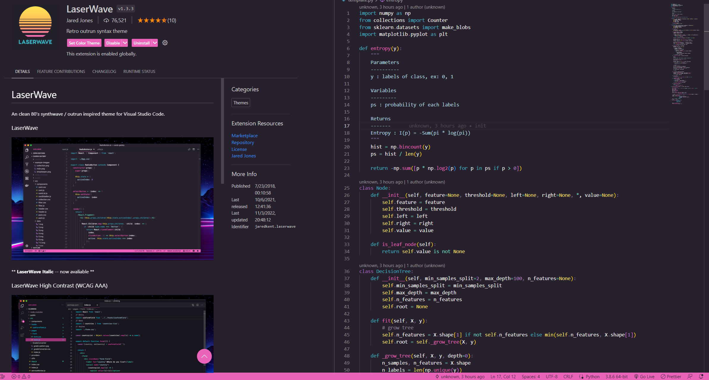

# vscode-extensions [Best]

    

[中文版README.md](README.zh-TW.md)

Vscode Common Commands

* Using the vscode command palette can improve development speed.

* Open the command palette: `ctrl+shift+p`

* Common Commands:
    * `File: Open Folder`: Open a folder as a workspace.
    * `Preferences: Color Theme`: Choose a color theme for the editor.
    * `Preferences: File Icon Theme`: Choose an icon theme for the files.
    * `Developer: Reload Window`: Reload the VSCode window.

---

* Record and share vscode extensions, including those that enhance development efficiency, must-haves, theme beautification, etc.
* This project will provide detailed usage instructions for each extension, with the hope of helping coders all over the world to code happily together :sunglasses:
* This project provides a ["**extensions sharing area**"](./share/README.md), where anyone can submit interesting extensions.
* If you want to **Pull Requests**, just update `README.md`

    ([`README.zh-TW.md`](https://github.com/Lin-jun-xiang/action-translate-markdown/tree/main) will auto update via CI)

* Outline of extensions:
    - [Quickly download multiple extensions (read this first)](#starquickly-download-multiple-extensions)
    - [Transparent editor](#snowflaketransparent-editor)
    - [Theme](#purple_hearttheme)
    - [Editor and environment beautification](#yellow_heart-beautifying-editor-and-editing-environment)
    - [Must-haves and highly recommended](#green_heart-must-have-highly-recommended)
    - [Big data and AI engineer - Jupyter(Python)](#star2big-data-ai-engineer---jupyter-python)
    - [Git and Markdown assistants](#wavegitmarkdown-support)
    - [Remote WSL & Dev-Container](#computer-remote-wsl--dev-container)
    - [Fixer](#wrenchfixer-fix-vscode-corrupt)
    - [Sharing and Contributing by Community](./share/README.md)

---

## :star:Quickly download multiple extensions
Later, we will introduce a lot of vscode extensions. Here is a trick that can quickly download many extensions without having to look for them one by one.

If you want to transfer extensions from an old computer to a new one in the future, you can also use this method:kissing:

* You can download the `.ps1` file attached to this project and exclude the extensions you don't need by following step three below.
* In the `extensions.ps1` file, each extension is annotated. Please delete the ones you don't need before executing the installation command.

> Method:
>
> 1. Access all the extensions of vscode on the current computer and output them as text. Enter the following command in terminal (`powershell`):
> `code --list-extensions | ForEach-Object {"code --install-extension $_"} > extensions.ps1`
>
> 2. After the command is executed, the `extensions.ps1` file (the filename is defined when executing the command) will be obtained in the current directory.
>
> 3. Enter the following command in terminal (`powershell`) on the new computer:
> `.\extensions.ps1`
>
> 4. Download completed
> 

Missing Extensions

* [`extensions-compare`](./extensions_compare/)

* Compare two `.ps` files and find the **difference** between the two extension records.

* Usage (choose one of the following):
    * `compare.py`
        Run the `Python` script.

        
    * `compare.sh`
        Run `./extensions_compare/compare.sh` on `git bash, wsl, or linux`, etc.

        

---

## :snowflake:Transparent editor
Transparent effects are awesome.

It can be a work lazy tool (code while watching videos~).

You can use your own desktop background while coding and watching **Gura**.

### GlassIt-VSC

> Usage:
`ctrl+alt+z`: decrease saturation (transparent)
`ctrl+alt+c`: increase saturation (opaque)

<a href="#top">Back to top</a>

---

## :purple_heart:Theme

The biggest reason for using vscode is to have an `eye-catching`, `elegant`, `comfortable`, and `pleasant editing interface`. Only a good-looking editing environment can make coders willing to type on the keyboard ~:sunglasses:

Next, the author will share his favorite themes with you one by one (the following examples are based on Python, and there may be slight differences for different languages)

Oh! Wait a minute, here's a quick way to switch themes. After all, you may want to change your theme every day~~

> Quickly switch themes
>
> "ctrl+shift+p": Open the vscode command input box
>
> "Preferences: Color Theme": Enter and select the theme you want

### Arc Dark for Visual Studio Code
* The theme is somewhat similar to the dark theme of Visual Studio Code, but with softer overall tones that resemble the colors of macarons.

### ButterTheme
* As its name suggests, it is a non-eye-straining *cream yellow* theme
* A very rare theme (to put it bluntly, not many people use it), but the author loves it
* In case you can't find this theme，<a href="https://marketplace.visualstudio.com/items?itemName=Levampire.Buttur" target="_blank">link</a>

### Coder200
* This time, I have absolutely no idea just by looking at the name...
* A very rare theme, filled with *orange* color, so sexy~ :flushed:

### doom-emacs-theme
* Simple style

<image src="https://user-images.githubusercontent.com/63782903/232356902-fc57dbc3-f650-4c41-b5a6-f33497954cc7.png" width="60%" />

### Dracula Official
* Very well-known, with a vampire color of *pink* and *purple*

### LaserWave
* A *purple-pink* theme with a sunset feel

### Moegi Theme
* A gentle and eye-friendly theme

### Material Dark
* One of the classic themes, cannot be ignored

### One Dark Pro
* One of the classic themes, cannot be ignored

### Panda Theme
* A top-notch theme with *lake green* :panda_face:
* This theme is really nice!

### Simple Dark
* The background is very dark, and the text color is not too harsh on the eyes

### Skyline
* Blue lovers must use it:blue_heart:

### SynthWave '84
* A super high-tech, flashy fluorescent theme :sunglasses:
* After selecting the theme, remember to activate the fluorescent effect (which can also be combined with other theme colors:fu:)

> To enable fluorescent mode:
>
> 1. "ctrl+shift+p": Open the VS Code command input box
>
> 2. "Synthwave '84: Enable/Disable Neon Dreams": Turn on/off (see figure)
>
> 3. "Restart": Restart VS Code

### Tearz
* It's a bit similar to the previously introduced Moegi theme
* But this *purple* is really attractive to the author~

### Xcode Theme
* One of the classic themes, cannot be ignored

<a href="#top">Back to top</a>

---
## :yellow_heart: Beautifying editor and editing environment
After decorating our editor, the plugins we are going to introduce can not only increase aesthetics but also improve work efficiency~

### Color Highlight
* If you are a **front-end** engineer or **data analyst** who often needs to do **visual** work, you must download this! 
* When editing, as long as a **hexadecimal** color expression appears, you can clearly see the color (no need to run the code to see if the color looks good).

### Material Theme Icons
* Different file extensions have different icons
* Not only look good but also make it faster to find files. 

### vscode-icons
* Slightly different from Material Theme Icons
* The author prefers to use this one~

<a href="#top">Back to top</a>

---
## :green_heart: Must-have, highly recommended
The plugins to be introduced below are really easy to use!

The vast majority of them can improve development efficiency, so don't miss them:heart_eyes:

### Code Runner
* I believe that those who use VSCode should not be unfamiliar with this plugin!?
* It allows VSCode to execute programs with one click.
* Supports many languages, such as C, C++, Java, JavaScript, PHP, Python, Perl...etc.

### Comment Divider
* Generates good-looking **comment styles** with shortcut keys.
* As shown in the figure below, you can see two styles: `Shift+Alt+x` and `Alt+x`.

### autoDocstring - Python Docstring Generator
* The plugin is introduced for Python developers.
* Quickly generate comments in **Docstring** style using shortcut keys.
* Describe the purpose, parameters, return values, and other information of the function.
* Support different **Docstring** styles, such as google, sphinx, numpy, etc.

> Usage: press the following key in the place where you want to generate comments
Windows: `ctrl+shift+2`
Mac: `cmd+shift+2` 

### Draw.io Integration
* Flowchart drawing tool
* When designing a project, you can use this plugin to plan feasibility.
* Can be used as a note-taking tool.
* Support many commonly used patterns, such as the Google Cloud Platform representative function symbol (as shown in the figure).

### Path Intellisense
* Having this plugin when coding is really great :kissing_heart:
* Suitable for code farmers who often read and write files.
* When writing a path, it will automatically list the files under the path you are looking for.

<a href="#top">Back to top</a>

---

## :star2:Big data, AI engineer - Jupyter (Python)
The plugin introduced here is really awesome!

The author knows many people who use Python are not used to using vscode, and there are many reasons:
* Interactive mode
* View variable data types and variable values (just like in Spyder, Pycharm)
* Execute code line by line and execute part of the code (really practical, even better than Debug~:heart_eyes:)

The plugin provides the following features:
* :pushpin:**Interactive mode**
* :pushpin:**View variable data types and variable values** (just like in Spyder, Pycharm)
* :pushpin:**Execute code line by line** and **execute part of the code** (really practical, even better than Debug~:heart_eyes:)

> If you can understand Chinese, it is recommended to spend 5 minutes quickly learning how to use the Jupyter plugin (view <a href="https://www.bilibili.com/video/BV1Bg411J78F/" target="_blank">link</a>)

> Usage:
>
> :bulb:Download the following plugins (some may not be needed, but I forgot~)
>
> `Jupyter`, `Jupyter keymap`, `Jupyter slide show`, `Jupyter cell tag`, `Jupyter notebook renderes`, `vs code jupyter notebook previewer`
>
>

> :bulb:**Execute code in interactive mode**
>
> 1. Right-click in the script.
> 2. Select `Run Current File in Interactive Window`
(It is recommended to set a VS Code shortcut key, I set it as `F10`).
> 3. After execution, an `Interactive` window will appear.
>
>
>

> :bulb:**View variable data types and variable values** (Need to be in interactive mode)
>
> Click *Variables* in the interactive window.
>
>

> :bulb:**Execute line by line or partially**
>
> 1. Select the code to execute (can be one or more lines).
> 2. Right-click the selected code.
> 3. Select *Run Selection/Line in Interactive Window*.
>
>

<a href="#top">Back to top</a>

---

## :wave:Git、Markdown Support
The plugins introduced below are essential for developers working on Github or Gitlab projects.

### GitLens
* After downloading, the script code will display **which** parts have been **modified**, **who** made the changes, and **when** they were made.
* Pay attention to the code on the right side of the screen. There is a green line at line `170`, which indicates that there is a record of new code added (red indicates deleted code).
* Remember to track the project with `git` for this plugin to work.

### Markdown Preview Enhanced
* When writing `.md` files, you can preview the results.
* Press `ctrl+k`, then `v` to open the preview window.
* The middle of the figure below shows the `.md` file, and the right side shows the preview window.

<a href="#top">Back to top</a>

---

## :computer: Remote WSL & Dev Container

### Remote WSL
* vscode will open in the `Windows Subsystem Linux` environment.
* You can edit files within the `WSL` environment in the vscode editor without using `vim` or `nano`.

> Usage:
> 1. `ctrl+shift+p`: open the command palette.
> 2. `WSL: New WSL Window`: open the `WSL` environment within vscode.

### Dev-Container
* With the help of `Docker`, the entire development environment within vscode can run in a container, including editing, terminal, debugging, and execution.

* You can perform various development tasks such as `Node.js`, `Python`, `Java`, etc. in the most comfortable way within an environment with only `Docker` and vscode installed, without the need to install corresponding runtime and compilation software.

<a href="#top">Back to top</a>

---

## :wrench:Fixer (Fix Vscode Corrupt)
Sometimes, when uninstalling a plugin, an error message appears in the lower right corner of the VS Code window as following:

You can solve this problem using the following method:

> Usage:
> 1. Download the Fix VSCode Checksums plugin.
> 2. `ctrl+shift+p`: open the command palette.
> 3. `Fix ChecksumS: Apply`: execute the repair.
> 4. `ctrl+shift+p`: open the command palette.
> 5. `Developer: Reload Window`: Restart VS Code.

<a href="#top">Back to top</a>
 