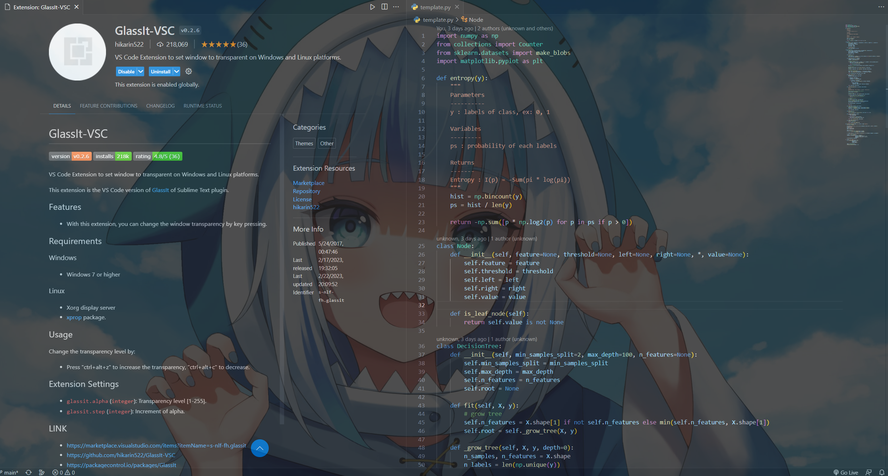
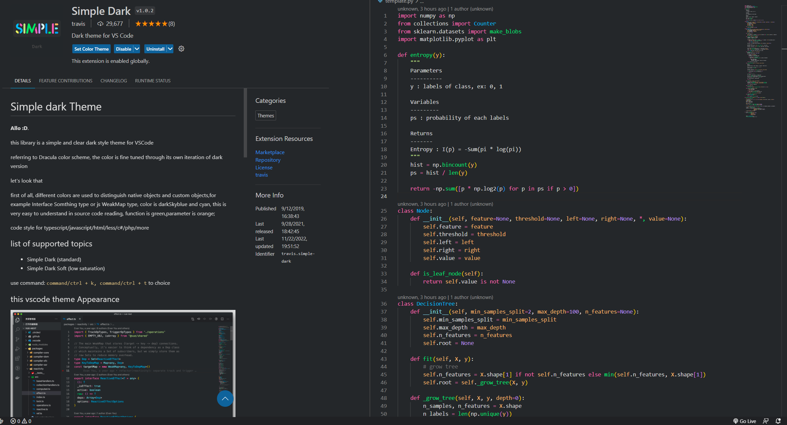
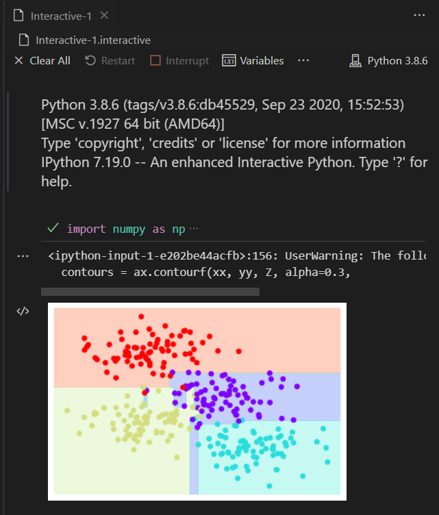
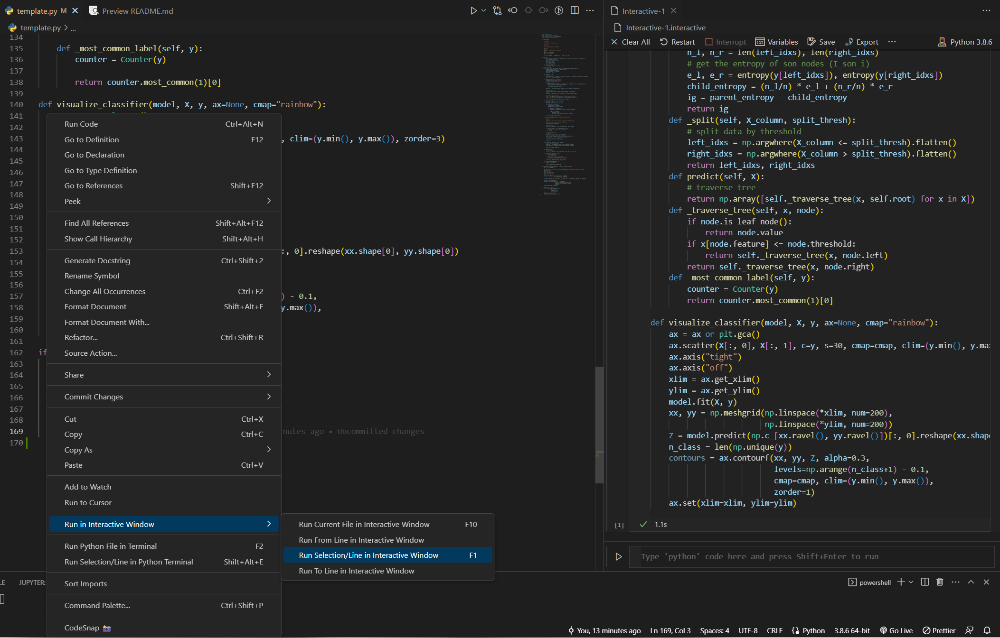
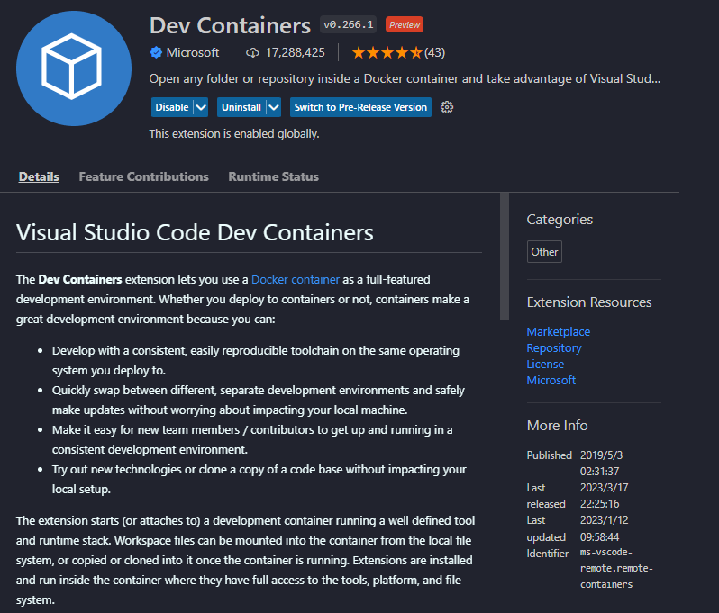

# vscode-extensions [Best]

    

[中文版README.md](README.zh-TW.md)

Vscode Common Commands

* 使用vscode命令面板可以提高開發速度.

* 打開命令面板:`ctrl+shift+p`

* 常用命令:
    * `File: Open Folder`:打開文件夾作為工作空間.
    * `Preferences: Color Theme`:為編輯器選擇顏色主題.
    * `Preferences: File Icon Theme`:為文件選擇圖標主題.
    * `Developer: Reload Window`:重新加載 VSCode 窗口.

---

* 記錄分享vscode擴展,包括提高開發效率、要點、主題美化等. .
* 本項目將為每個擴展提供詳細的說明,希望能幫助全世界的碼農們一起愉快地編碼:sunglasses:
* 本項目提供["**擴展分享區**"](./share/README.md),大家可以在這裡提交感興趣的擴展.
* 如果你想要 **Pull Request**,只需更新 `README.md`

    ([`README.zh-TW.md`](https://github.com/Lin-jun-xiang/action-translate-markdown/tree/main)會通過CI自動更新)

* 擴展摘要:
    - [快速下載多個擴展(先閱讀這個)](#starquickly-download-multiple-extensions)
    - [透明編輯器](#snowflaketransparent-editor)
    - [主題](#purple_hearttheme)
    - [編輯器和環境美化](#yellow_heart-beautifying-editor-and-editing-environment)
    - [必備和強烈推薦](#green_heart-must-have-highly-recommended)
    - [大數據與AI工程師-Jupyter(Python)](#star2big-data-ai-engineer---jupyter-python)
    - [Git 和 Markdown 助手](#wavegitmarkdown-support)
    - [遠程 WSL 和開發容器](#computer-remote-wsl--dev-container)
    - [修復器](#wrenchfixer-fix-vscode-corrupt)
    - [Copilot 輔助](#codeium)
    - [社區共享和貢獻](./share/README.md)

---

## :star:Quickly download multiple extensions
後面會介紹很多vscode的擴展 . 這裡有一個技巧,不用一個一個的找.就可以快速下載很多擴展

如果以後想把舊電腦的擴展轉移到新電腦上,也可以用這個方法:kissing:

* 可以下載本項目自帶的`.ps1`文件,按照下面第三步排除不需要的擴展名.
* 在`extensions.ps1`文件中,每個擴展名都有註釋.,請在執行安裝命令前刪除不需要的.

> 方法:
>
> 1. 訪問當前電腦上vscode的所有擴展,輸出為文本 . 在終端(`powershell`)輸入如下命令:
> `code --list-extensions | ForEach-Object {"code --install-extension $_"} > extensions.ps1`
>
> 2. 命令執行後,會在當前目錄下得到`extensions.ps1`文件(文件名是命令執行時定義的).
>
> 3. 在新電腦的終端(`powershell`)輸入以下命令:
> `./extensions.ps1`
>
> 4. 下載完成
> 

Missing Extensions

* [`extensions-compare`](./extensions_compare/)

* 比較兩個 `.ps` 文件以查找兩個擴展記錄 . 之間的**差異**

* 用法(選擇以下之一):
    * `compare.py`
         運行 `Python` 腳本 .

        
    * `compare.sh`
         在 `./extensions_compare/compare.sh` 上運行 `git bash, wsl, or linux` 等 .

        

---

## :snowflake:Transparent editor
透明效果很贊.

可以當個偷懶工具(邊看視頻邊碼字~).

您可以在編碼和觀看時使用自己的桌面背景 **Gura** .

### GlassIt-VSC

> 用法:
`ctrl+alt+z`:去飽和度(透明度)
`ctrl+alt+c`:增加飽和度(不透明度)

<a href="#top">Back to top</a>

---

## :purple_heart:Theme

使用vscode最大的原因就是要有`eye-catching`, `elegant`, `comfortable`, `pleasant editing interface`. 只有好看的編輯環境才能讓coder願意敲鍵盤~:sunglasses:

接下來,我將我最喜歡的話題一一分享給大家(以下示例均基於Python,不同語言可能略有差異)

哦！等一下,這裡有一個快速切換主題的方法.畢竟你可能每天都想換主題~~

> 快速切換主題
>
> "ctrl+shift+p": 打開vscode命令輸入框
>
> "Preferences:Color Theme": 進入並選擇你想要的主題

### Arc Dark for Visual Studio Code
* 主題有點類似於Visual Studio Code的深色主題,但是整體色調更加柔和,類似於馬卡龍的顏色.

### ButterTheme
* 顧名思義,這是一款養眼的*奶黃色*主題
* 非常難得的一個主題(說白了,用的人不多),但是作者很喜歡
* 如果找不到這個主題,<a href="https://marketplace.visualstudio.com/items?itemName=Levampire.Buttur" target="_blank">鏈接</a>

### Coder200
* 這次光看名字完全不認識...
* 稀有主題,充滿*橙色*,好性感~:flushed:

### doom-emacs-theme
* 簡約風格

<image src="https://user-images.githubusercontent.com/63782903/232356902-fc57dbc3-f650-4c41-b5a6-f33497954cc7.png" width="60%" />

### Dracula Official
*非常有名,*粉色*和*紫色*吸血鬼顏色

### LaserWave
* 具有日落感覺的*紫粉色*主題

### Moegi Theme
* 溫柔嫵媚的主題

### Material Dark
* 不容忽視的經典題材之一

### One Dark Pro
* 不容忽視的經典題材之一

### Panda Theme
* *Lake Green* :panda_face: 一流的主題:
* 這個主題真的很酷！

### Simple Dark
* 背景很暗,文字顏色不會太刺眼

### Skyline
* 藍色愛好者必須使用它:blue_heart:

### SynthWave '84
* 超高科技,炫目熒光主題:sunglasses:
* 選擇主題後記得開啟熒光效果(也可以搭配其他主題色:emoji_fu :)

> 啟用熒光模式:
>
> 1. "ctrl+shift+p": 打開VS Code命令輸入框
>
> 2. "Synthwave '84: Enable/Disable Neon Dreams": 啟用/禁用霓虹夢(見圖)
>
> 3. "Restart": 重啟 VS Code

### Tearz
* 有點類似於之前推出的萌木主題
*不過這個*紫色*真的很吸引作者~

### Vuesion Theme
* 簡單的粉色,看起來很舒服

### Xcode Theme
* 不容忽視的經典題材之一

<a href="#top">Back to top</a>

---
## :yellow_heart: Beautifying editor and editing environment
裝修完我們小編,接下來要介紹的插件不僅可以增加美感,還可以提高工作效率~

### Color Highlight
* 如果你是**前端**工程師或**數據分析師**,並且經常需要做**視覺**工作,一定要下載這個！
* 編輯的時候,只要有**16進制**的顏色表達,就可以很清楚的看到顏色(顏色好看就不用跑代碼了).

### Material Theme Icons
* 不同的文件擴展名有不同的圖標
* 不僅好看而且可以更快地找到文件.

### vscode-icons
* 與 Material 主題圖標略有不同
* 作者比較喜歡用這個~

<a href="#top">Back to top</a>

---
## :green_heart: Must-have, highly recommended
下面要介紹的插件真的好用！

大部分可以提高開發效率,不要錯過:heart_eyes:

### Code Runner
* 相信用過VSCode的朋友應該對這個插件不陌生吧！ ？
* 允許VSCode一鍵執行程序.
* 支持多種語言,如C、C++、Java、JavaScript、PHP、Python、Perl...etc.

### Comment Divider
* 使用快捷鍵生成漂亮的**評論樣式**.
* 如下圖,可以看到兩種樣式:`Shift+Alt+x`和`Alt+x`.

### autoDocstring - Python Docstring Generator
* 這個插件是由 . 為 Python 開發者引入的
* 使用快捷鍵快速生成**Docstring**風格的註釋.
* 描述函數的用途、參數、返回值等信息.
* 支持不同的**Docstring**風格,如google、sphinx、numpy等. .

> 使用方法:在要生成評論的地方按下面的鍵
Windows:`ctrl+shift+2`
蘋果機:`cmd+shift+2`

### Draw.io Integration
* 流程圖繪製工具
* 設計項目時,可以使用本插件規劃可行性.
* 可作為筆記工具使用 .
* 支持很多常用模式,比如穀歌云平台代表功能符號(如圖).

### Path Intellisense
* 編碼時有這個插件真的很酷:kissing_heart:
* 適合經常讀寫文件的coder .
* 寫路徑的時候會自動列出你要查找的路徑下的文件.

<a href="#top">Back to top</a>

---

## :star2:Big data, AI engineer - Jupyter (Python)
這裡介紹的插件真的很強大！

筆者知道很多使用Python的人都不習慣使用vscode,原因有很多:
* 互動模式
* 查看變量數據類型和變量值(就像在Spyder、Pycharm中一樣)
* 逐行執行代碼,執行部分代碼(真的很實用,比Debug好用~:heart_eyes:)

該插件提供以下功能:
* :pushpin:**交互模式**
* :pushpin:**查看變量數據類型和變量值**(如Spyder、Pycharm)
* :pushpin: **逐行執行代碼**和**執行部分代碼**(真的很有用,比調試好~:heart_eyes :)

> 如果你能看懂中文,建議花5分鐘快速學會Jupyter插件的使用方法(見<a href="https://www.bilibili.com/video/BV1Bg411J78F/" target ="_blank">鏈接</a>)

> 用法:
>
> :bulb: 下載以下插件(有些可能用不到,算了~)
>
> `Jupyter`、`Jupyter keymap`、`Jupyter slide show`、`Jupyter cell tag`、`Jupyter notebook renderes`、`vs code jupyter notebook previewer`
>
>

> :bulb:**在交互模式下執行代碼**
>
> 1. 右鍵單擊腳本中的 .
> 2. 選擇 `Run Current File in Interactive Window`
(建議設置一個VS Code快捷鍵,我設置為`F10`).
> 3 . `Interactive` 窗口 . 執行後會出現
>
>
>

> :bulb:**查看變量數據類型和變量值**(需要處於交互模式)
>
> 在交互窗口中點擊 *Variables*.
>
>

> :bulb: **逐行或部分執行**
>
> 1. 選擇要執行的代碼(可以是一行或多行) .
> 2. 右鍵單擊所選代碼.
> 3 . SELECT *在交互式窗口中運行選擇/行* .
>
>

<a href="#top">Back to top</a>

---

## :wave:Git、Markdown Support
下面描述的插件對於從事 Github 或 Gitlab 項目的開發人員來說是必不可少的 .

### GitLens
* 下載後,腳本代碼將顯示**哪些**部分被**修改**,**誰**進行了更改,**何時**修改了.
* 注意屏幕右側.`170`行有綠線表示有新代碼記錄(紅色表示刪除代碼).
* 請記住使用 `git` 跟踪項目以使該插件工作 .

More for GitLens

* 比較兩個提交的詳細**差異**
    * `COMMITS`:選擇要與HEAD比較的提交(step1~2)
    * `SEARCH & COMPARE`:選擇更改的文件(第 3 步)
    * `diff`:正確的文件是 HEAD(第 4 步)

        

### Markdown Preview Enhanced
* 寫入`.md`文件時,可以預覽結果.
* 按 `ctrl+k`,然後按 `v` 打開預覽窗口 .
* 下圖中間是`.md`文件,右邊是預覽窗口.

### Paste Image
* 將圖像直接從剪貼板粘貼到 markdown/asciidoc(或其他文件)！
* 用法
    * 截屏到剪貼板
    * 使用默認鍵盤綁定:`Ctrl+Alt+V`(Mac 上為 `Cmd+Alt+V`).
    * 圖像將保存在包含當前編輯文件的文件夾中
    * 相對路徑將被粘貼到當前編輯文件

* 您可以在 settings. 中配置 `imagePath`

    

<a href="#top">Back to top</a>

---

## :computer: Remote WSL & Dev Container

### Remote WSL
* vscode 將在 `Windows Subsystem Linux` 環境中打開 .
* 您可以在 vscode 編輯器中編輯 `WSL` 環境中的文件,而無需使用 `vim` 或 `nano`.

> 用法:
> 1. `ctrl+shift+p`: 打開命令面板 .
> 2 . `WSL: New WSL Window`: 在 vscode . 中打開 `WSL` 環境

### Dev-Container
* 使用`Docker`,vscode內部的整個開發環境都可以在容器中運行,包括編輯、終端、調試、執行.

* `Node.js`、`Python`、`Java`、etc.等開發任務,只需要安裝`Docker`和vscode,無需安裝相應的runtime和編譯軟件.

<a href="#top">Back to top</a>

---

## :wrench:Fixer (Fix Vscode Corrupt)
有時,在卸載插件時,VS Code 窗口的右下角會出現如下錯誤信息:

您可以使用以下方法解決此問題:

> 用法:
> 1. 下載修復 VSCode 校驗和插件 .
> 2. `ctrl+shift+p`: 打開命令調色板 .
> 3. `Fix ChecksumS: Apply`:執行修復 .
> 4. `ctrl+shift+p`:打開命令調色板 .
> 5. `Developer: Reload Window`: 重啟 VS Code.

<a href="#top">Back to top</a>

## :rocket: Copilot
類似 ChatGPT 的 AI 輔助開發工具，讓大家在開發過程中更快速

### Codeium
* 完全**免費**使用 !
* 功能與 ChatGPT、Copilot 勘比
* 使用該工具，您可以:
    * 自動生成代碼
    * 自動生成註解、`Docstring`
    * 自動生成 `Annotation hint`
    * 提高代碼質量

    

* 使用方法
    * 點選代碼區塊的 `Refactor`

        

    * 選擇您要進行的處理，例如: `Add comments and docstrings to the code`

        

    * 生成 `Codeium` 聊天區塊

        

    * 代碼提煉完成!

<a href="#top">Back to top</a>
