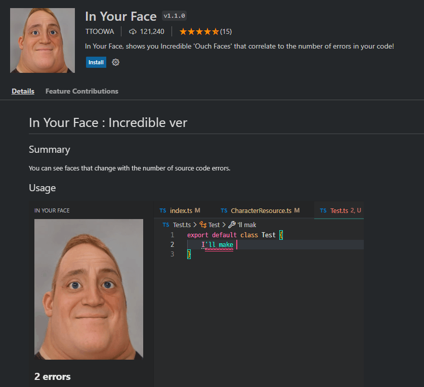

## Sharing and Contributing by Community

* Anyone can share interesting and useful extensions in "**Discussions**"

* Anyone can post interesting and useful extensions in "`share/README.md`" via **Pull Requests**

---

### In Your Face

* "In Your Face" is a VS Code extension that shows you Doom "Ouch Faces" relative to the number of bugs in your code! !

### Power Mode

* Power Mode adds animations like pop-ups, sparks and flickers as you type code to enhance the editing experience .

* You can also create your own custom effects .

<image src="https://user-images.githubusercontent.com/130225999/231623769-d86a09e8-1611-4b38-a6ba-c87aea9bd13f.png" width="60%" />

### LegacyDoc AI

* LegacyDoc AI is a VS Code extension that generates AI code audit reports, Mermaid architecture maps, JSDoc, Markdown docs, and AI-ready context packs from your codebase.

* It is useful for inherited projects, AI-generated MVPs, and vibe-coded prototypes that need documentation and cleanup context before refactor or handoff.

* Product page: <https://www.romanticode.com/legacydoc-ai/>

* VS Code Marketplace: <https://marketplace.visualstudio.com/items?itemName=ruilegendoc.legacy-doc-ai>
