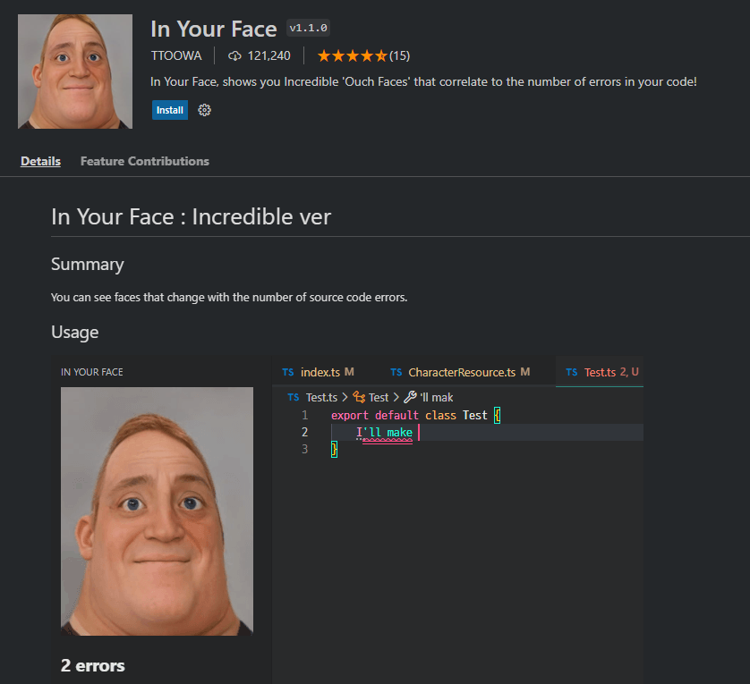

## Sharing and Contributing by Community

* Anyone can share interesting and useful extensions in "**Discussion**".

* Anyone can post interesting and useful extensions in "`share/README_Chinese.md`" through **Pull Requests**.

---

### In Your Face

* "In Your Face" is a VS Code extension that shows you Doom 'Ouch Faces' that correlate to the number of errors in your code!！

  

### Power Mode

* "Power Mode" can adds animated effects such as pop-ups, sparks, and flashes as you type code to enhance the editing experience.

* Can also create your own custom effects.

  <image src="https://user-images.githubusercontent.com/130225999/231623769-d86a09e8-1611-4b38-a6ba-c87aea9bd13f.png" width="60%" />
       