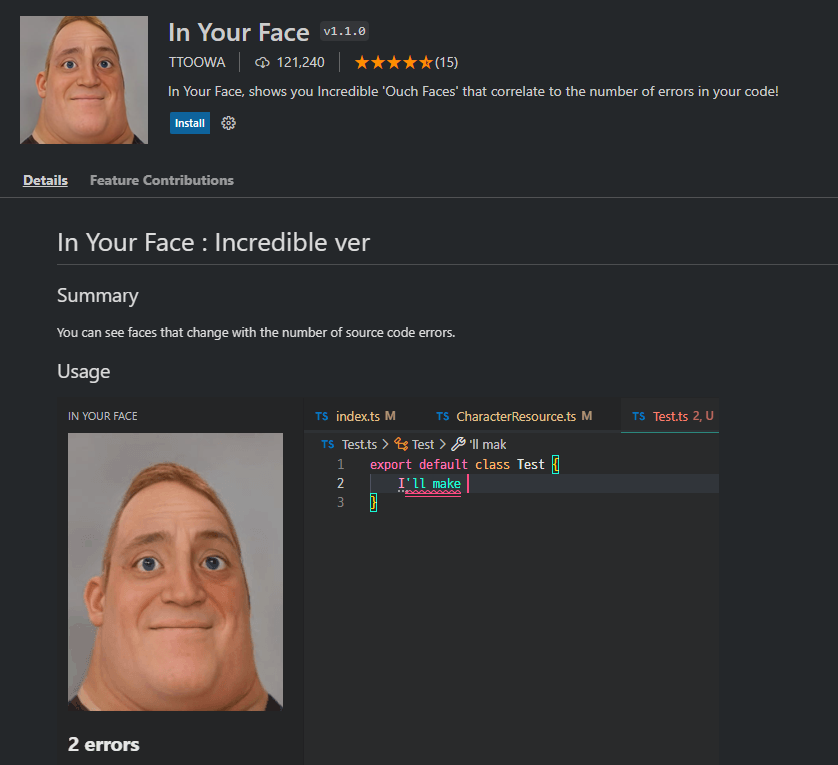

## 網友分享與投稿

* 任何人都可以在 "**Discussion**" 中分享自己覺得有趣、有用的插件

* 任何人都可以在 "`share/README_中文.md`" 中投稿自己覺得有趣、有用的插件 (**Pull requests**)

---

### In Your Face

* "In Your Face" 是一個 VS Code 擴充套件，它會顯示「毀滅戰士」遊戲中的「疼痛臉」，這些臉的表情會對應您程式碼中出現錯誤的數量！

### Power Mode

* "Power Mode" 可以在你輸入程式碼的同時添加彈出效果、火花和閃爍等動畫效果，以增強編輯體驗

* 你也可以創建自己的自定義效果

  <image src="https://user-images.githubusercontent.com/130225999/231623769-d86a09e8-1611-4b38-a6ba-c87aea9bd13f.png" width="60%" />
 
